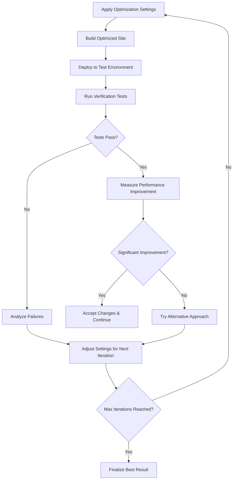

# AI-Powered Website Optimization Guide

## Overview

This system uses Claude Opus 4.6 to automatically optimize websites for performance, accessibility, SEO, and security. The AI learns from each optimization and continuously improves its strategies.

## How AI Optimization Works

### 1. Analysis Phase (PHASE 1)

The AI agent begins by comprehensively analyzing the target website:

**Site Inventory Collection:**
- Crawls all pages using Playwright browser automation
- Identifies interactive elements (sliders, modals, accordions, forms)
- Detects WordPress themes, plugins, and dependencies
- Maps out resource dependencies (CSS, JS, images, fonts)
- Takes baseline screenshots across multiple viewports

**PageSpeed Insights Integration:**
- Fetches complete Lighthouse audit data (performance, accessibility, SEO, best practices)
- Analyzes Core Web Vitals (LCP, TBT, CLS, FCP, SI)
- Identifies specific optimization opportunities with impact scoring
- Maps audit failures to actionable optimization strategies

### 2. AI Planning Phase (PHASE 1B)

The AI generates an intelligent optimization strategy:

```typescript
interface EnhancedOptimizationPlan {
  prioritizedAudits: Array<{
    auditId: string;
    category: 'performance' | 'accessibility' | 'seo' | 'security';
    impact: 'high' | 'medium' | 'low';
    weight: number; // Lighthouse weighting factor
    estimatedImprovement: number; // Expected score improvement
  }>;
  riskAssessment: {
    breakageRisk: 'low' | 'medium' | 'high';
    visualChanges: boolean;
    functionalityImpact: string[];
  };
  optimizationStrategy: OptimizationAction[];
}
```

**Audit Prioritization Logic:**
1. **High Impact Performance** (55% weight): TBT, LCP optimizations
2. **Accessibility Compliance** (Required): Alt text, contrast, ARIA labels  
3. **SEO Fundamentals** (20% weight): Meta tags, structured data
4. **Security Best Practices** (15% weight): HTTPS, CSP headers

### 3. Iterative Optimization (PHASES 2-4)

The AI runs up to 10 optimization iterations, learning from each attempt:

**Settings-First Approach:**
1. **Tier 1**: Apply proven precoded settings
2. **Tier 2**: Generate custom setting combinations
3. **Tier 3**: Safe HTML/CSS modifications  
4. **Tier 4**: Advanced JavaScript optimizations

**Per-Iteration Process:**


### 4. AI Learning Integration

Every optimization feeds into the learning system:

**Success Pattern Recognition:**
- Tracks which optimization strategies work for different site types
- Builds knowledge base of successful setting combinations
- Identifies common failure patterns to avoid

**Cross-Site Learning:**
- Learns that "Elementor + WooCommerce + large images" sites benefit from aggressive image compression
- Recognizes when jQuery removal breaks specific plugin interactions
- Adapts CSS purging aggressiveness based on theme complexity

## Optimization Categories

### Performance Optimizations

**Image Optimization:**
- Multi-format conversion (WebP, AVIF) with quality tiers
- Responsive image generation with srcset
- Lazy loading with intersection observer
- LCP image preloading and fetch priority

**CSS Optimization:**
- PurgeCSS with intelligent safelist generation
- Critical CSS extraction and inlining
- Non-render-blocking stylesheet loading
- Font-display optimization

**JavaScript Optimization:**
- Tree shaking and dead code elimination
- Script deferral and async loading
- jQuery dependency analysis and safe removal
- Module bundling and code splitting

**HTML Optimization:**
- WordPress bloat removal (RSD links, emoji scripts, etc.)
- HTML minification with layout preservation
- Resource hint injection (preload, preconnect, dns-prefetch)
- Meta tag optimization for performance

### Accessibility Improvements

**Image Accessibility:**
- Automatic alt text generation using AI vision analysis
- Decorative image identification (alt="")
- Image context analysis for meaningful descriptions

**Structural Accessibility:**
- ARIA label injection for unlabeled buttons
- Heading hierarchy validation and correction
- Color contrast analysis and adjustment recommendations
- Focus management for interactive elements

### SEO Enhancements  

**Meta Data Optimization:**
- Title tag generation and optimization
- Meta description creation from page content
- Open Graph and Twitter Card injection
- Canonical URL standardization

**Structured Data:**
- Schema.org markup injection
- LocalBusiness, Organization, WebSite schemas
- Product markup for e-commerce sites
- FAQ and How-to structured data

### Security Hardening

**Content Security Policy:**
- Automatic CSP header generation
- Trusted Types implementation for XSS prevention
- Script and style source whitelisting
- Frame ancestors and object source restrictions

**HTTP Security Headers:**
- HSTS implementation with preload
- X-Frame-Options configuration
- X-Content-Type-Options nosniff
- Referrer Policy optimization

## AI Decision Making

### Risk Assessment

The AI evaluates risk before making changes:

**Low Risk Changes:**
- Image compression and format conversion
- CSS/JS minification and compression
- Meta tag additions
- Security header implementation

**Medium Risk Changes:**
- CSS purging with custom safelists
- Script deferral and async loading
- WordPress feature removal
- Font optimization and self-hosting

**High Risk Changes:**
- jQuery removal and replacement
- Aggressive HTML minification
- Custom CSS/JS code modifications
- Third-party widget replacement

### Rollback Mechanisms

**Automatic Rollback Triggers:**
- Performance score decrease > 5 points
- Visual regression detection via screenshot comparison
- Functional test failures (forms, menus, sliders)
- JavaScript console errors
- Accessibility score degradation

**Progressive Fallback:**
When high-risk optimizations fail, the AI automatically:
1. Reduces optimization aggressiveness
2. Applies safer setting combinations
3. Excludes problematic optimization types
4. Documents failure patterns for future learning

## Verification Systems

### Performance Verification
- PageSpeed Insights API validation
- Core Web Vitals measurement (LCP < 2.5s, TBT < 300ms, CLS < 0.1)
- Business impact calculation (conversion rate, bounce rate improvements)

### Visual Verification  
- Multi-viewport screenshot comparison (mobile, tablet, desktop)
- AI-powered visual difference analysis using Claude Vision
- Layout shift detection and quantification

### Functional Verification
- Interactive element testing (dropdowns, sliders, modals)
- Form submission validation
- Navigation functionality checks
- Third-party integration testing

### Accessibility Verification
- WCAG compliance checking
- Screen reader navigation testing
- Keyboard navigation validation
- Color contrast measurement

## Learning and Adaptation

### Pattern Recognition

The AI builds patterns like:
```json
{
  "pattern": "WordPress + Elementor + WooCommerce",
  "characteristics": ["large DOM size", "jQuery dependent", "many CSS files"],
  "successful_optimizations": [
    "aggressive_image_compression",
    "css_purging_moderate",
    "script_deferral_selective"
  ],
  "failed_optimizations": [
    "jquery_removal",
    "aggressive_css_purging"
  ],
  "success_rate": 0.87,
  "avg_performance_improvement": 23.5
}
```

### Continuous Improvement

**Knowledge Base Growth:**
- Every optimization adds to the collective knowledge
- Failed approaches are documented to avoid repetition
- Successful patterns are reinforced and refined
- Edge cases are identified and handled

**AI Model Updating:**
- Regular fine-tuning based on optimization outcomes
- Incorporation of new PageSpeed audit types
- Adaptation to changing web standards and best practices
- Integration of user feedback and manual overrides

This AI system represents a sophisticated approach to web optimization that combines automated tooling with intelligent decision-making, continuous learning, and comprehensive safety mechanisms to deliver consistent performance improvements while preserving site functionality and user experience.